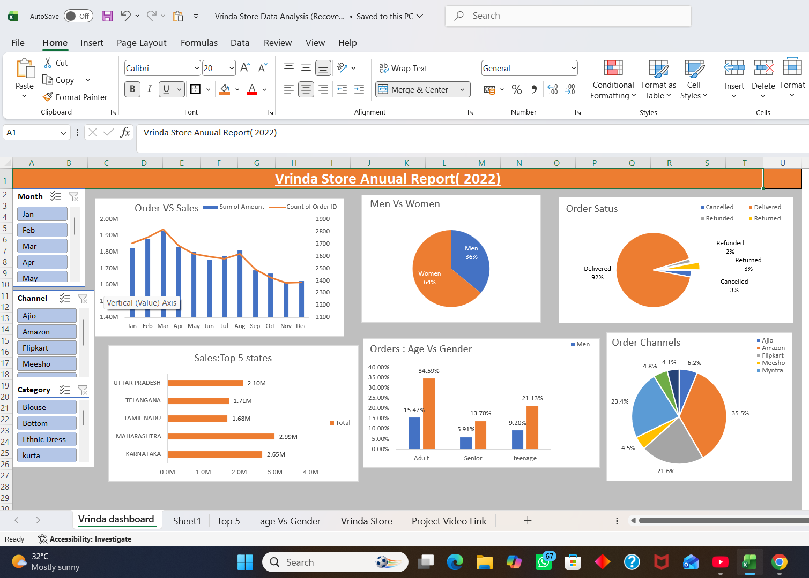

# 📊 Vrinda Store Sales Analysis using Microsoft Excel

## 🎯 Objective

The objective of this project is to analyze **Vrinda Store's 2022 sales data** and create an interactive sales dashboard in **Microsoft Excel**. The dashboard helps identify customer purchasing behavior, sales trends, top-performing states, sales channels, and product categories. The insights generated from this analysis can support data-driven business decisions and help improve sales performance.

## 📂 Dataset

The dataset used in this project contains **Vrinda Store's 2022 sales records**. It includes customer demographics, order details, sales information, product categories, order status, and sales channels.

### Dataset Features

- Order ID
- Order Date
- Customer Age
- Gender
- State
- Sales Amount
- Product Category
- Quantity
- Order Status
- Sales Channel

- ## 🧹 Data Cleaning

Before performing the analysis, the dataset was cleaned to improve data quality and ensure accurate results.

### Data Cleaning Tasks

- Checked the dataset for missing values.
- Verified duplicate records.
- Standardized text values for consistency (e.g., Gender and Order Status).
- Converted the Order Date column into a proper date format.
- Checked numerical columns such as Sales Amount and Quantity for incorrect values.
- Removed unnecessary spaces and formatting inconsistencies.
- Verified that all records were complete and ready for analysis.

- ## ⚙️ Data Preprocessing

After cleaning the dataset, it was prepared for analysis by creating additional fields and organizing the data for reporting.

### Data Preprocessing Tasks

- Created a **Month** column from the Order Date for monthly sales analysis.
- Created an **Age Group** column (Adult, Senior, Teenager) using Excel formulas.
- Formatted data for Pivot Tables and Pivot Charts.
- Verified data consistency before dashboard creation.
- Organized the dataset for interactive analysis using slicers and filters.

- ## ❓ Business Questions

The analysis was performed to answer the following business questions:

1. Compare Sales and Orders using a single chart.
2. Which month recorded the highest Sales and Orders?
3. Who purchased more products – Men or Women?
4. What are the different Order Status values?
5. Which are the Top 10 States contributing to Sales?
6. What is the relationship between Age Group and Gender?
7. Which Sales Channel generated the highest revenue?
8. Which Product Category contributed the highest sales?

   
## 📊 Data Analysis

The dataset was analyzed using Microsoft Excel to identify sales trends, customer purchasing behavior, and business performance. Pivot Tables and Pivot Charts were used to summarize and visualize the data.

The following analyses were performed:

- Monthly Sales and Order Analysis
- Sales by Gender
- Order Status Distribution
- Top 10 States by Sales
- Age Group vs Gender Analysis
- Sales Channel Performance
- Product Category Analysis

The analysis was visualized through an interactive dashboard with slicers, allowing users to filter data by Month, Category, and Sales Channel.

## 📈 Key Insights

Based on the analysis, the following key insights were identified:

- Women customers contributed approximately **65%** of the total sales, making them the primary customer segment.
- Adult customers (30–49 years) accounted for the highest number of purchases.
- March recorded the highest sales and order volume during 2022.
- Maharashtra was the highest revenue-generating state, followed by Karnataka and Uttar Pradesh.
- Amazon emerged as the top-performing sales channel, followed by Flipkart and Myntra.
- The **Set** category was the highest-selling product category.
- Most customer orders were successfully delivered, indicating a high order fulfillment rate.
- The interactive dashboard enabled analysis of sales performance by month, state, gender, age group, category, and sales channel.
## 🎯 Final Conclusion

Based on the analysis, the following recommendations can help improve Vrinda Store's sales performance:

- Focus marketing campaigns on **women customers**, as they contribute the highest share of total sales.
- Target customers in the **30–49 years** age group, who represent the largest purchasing segment.
- Increase promotional campaigns and advertisements in **Maharashtra, Karnataka, and Uttar Pradesh**, the top three revenue-generating states.
- Strengthen partnerships and offer exclusive discounts on **Amazon, Flipkart, and Myntra**, as these channels generate the majority of sales.
- Maintain adequate inventory for the highest-selling product categories to meet customer demand.
- Use the interactive dashboard to monitor sales performance regularly and support data-driven business decisions.

- ## 🛠️ Skills & Tools Used

### Tools
- Microsoft Excel

### Excel Features
- Pivot Tables
- Pivot Charts
- Slicers
- Conditional Formatting
- IF Formula
- Text Functions
- Date Functions

### Data Analytics Skills
- Data Cleaning
- Data Preprocessing
- Data Analysis
- Data Visualization
- Dashboard Design
- Business Insights

- ## 📷 Dashboard Preview

- 
